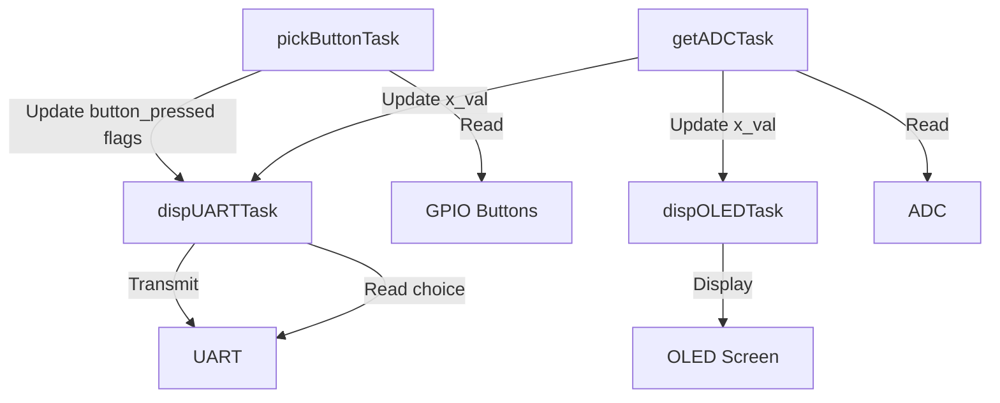
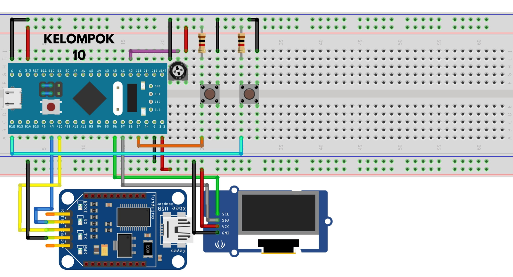
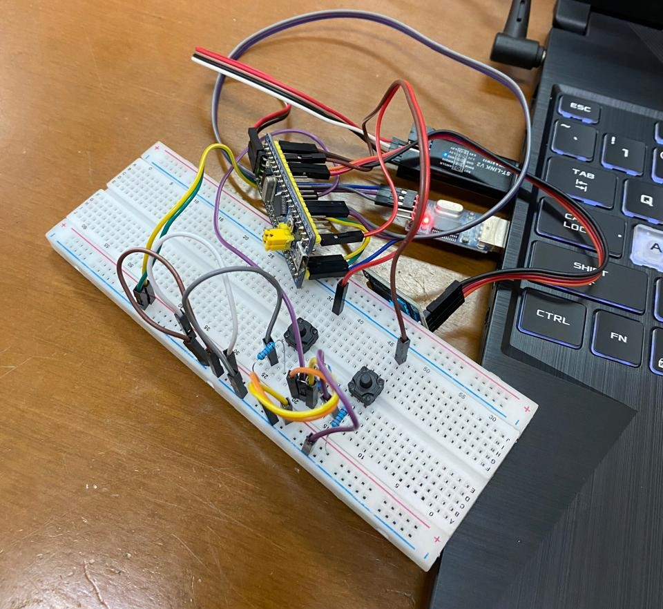

# Proyek RTOS STM32 Blue Pill

Proyek ini merupakan implementasi Real-Time Operating System (RTOS) pada STM32 Blue Pill (STM32F103C8) menggunakan FreeRTOS. Sistem ini mendemonstrasikan penggunaan multitasking untuk mengelola berbagai fungsi seperti pembacaan ADC, pemantauan tombol, tampilan OLED, dan komunikasi UART.

## Deskripsi Proyek

Proyek ini terdiri dari beberapa task yang berjalan secara bersamaan:

1. **pickButtonTask**: Memantau status tombol.
2. **getADCTask**: Membaca nilai ADC.
3. **dispOLEDTask**: Menampilkan data pada layar OLED.
4. **dispUARTTask**: Mengelola komunikasi UART dan menu interaktif.

Sistem ini menunjukkan bagaimana RTOS dapat digunakan untuk mengelola berbagai tugas secara efisien pada sistem embedded.

## Penjelasan Task

### pickButtonTask
- Prioritas: Normal
- Fungsi: Memantau status dua tombol (Button1 dan Button2).
- Operasi: Membaca status GPIO, menerapkan debouncing, dan mengatur flag global ketika tombol ditekan.

### getADCTask
- Prioritas: Di atas Normal
- Fungsi: Membaca nilai ADC secara periodik.
- Operasi: Memulai konversi ADC, membaca nilai, dan menyimpannya dalam variabel global `x_val`.

### dispOLEDTask
- Prioritas: Normal
- Fungsi: Menampilkan data ADC pada layar OLED.
- Operasi: Memperbarui tampilan OLED dengan nilai ADC terbaru setiap siklus.

### dispUARTTask
- Prioritas: Normal
- Fungsi: Mengelola komunikasi UART dan menu interaktif.
- Operasi: Menampilkan menu, memproses input pengguna, mengirimkan data ADC, dan memberitahu penekanan tombol melalui UART.

## Hubungan Antar Task

- **pickButtonTask** mengatur flag global yang dibaca oleh **dispUARTTask**.
- **getADCTask** memperbarui nilai ADC yang digunakan oleh **dispOLEDTask** dan **dispUARTTask**.
- **dispUARTTask** membaca input dari UART dan merespon dengan mengirimkan data atau pesan.
- Semua task menggunakan `osDelay()` untuk memberikan kesempatan pada task lain untuk berjalan.

## Diagram Alur Kerja

Berikut adalah diagram yang mengilustrasikan alur kerja dan interaksi antar task:

Diagram ini menunjukkan bagaimana setiap task berinteraksi dengan hardware dan satu sama lain melalui variabel global dan flag.

## Gambar Rangkaian

<figure>
  <figcaption>Gambar 1: Skema Rangkaian Sistem</figcaption>
  
</figure>
 
<figure>
  <figcaption>Gambar 2: Implementasi Hardware</figcaption>
  
</figure>

## Documentation

<figure>
  <figcaption>Short Video</figcaption>
  
</figure>
